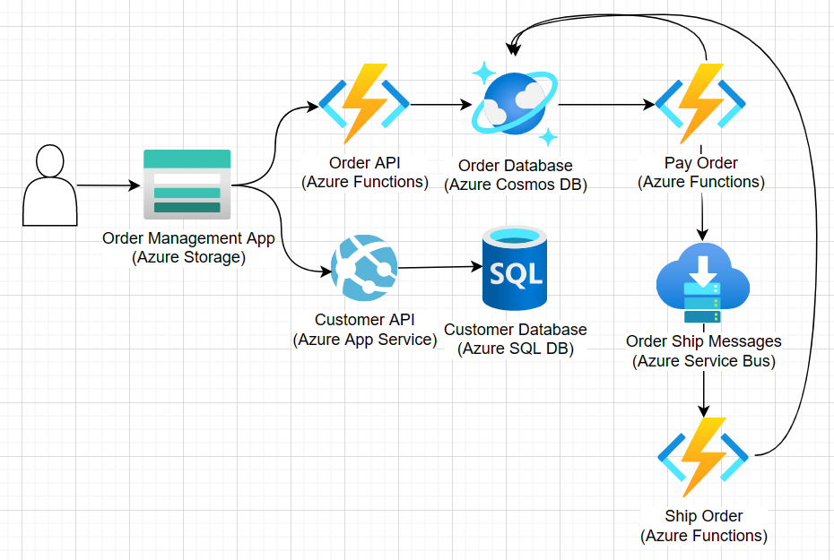

# Order Management for Java

This is a sample solution for order management primarily geared toward Java developers. By working through this solution, you will learn how to build and deploy a full Java-based solution while using Azure services.

## Solution Overview

A local company has reached out to help build an order processing system in Azure. For the first portion of this project, you will rehost an existing order management app and customer API that the company already uses. For the second portion of this procect, you will build out an Azure Functions driven processing pipeline to create the overall solution this company needs.

